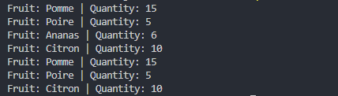
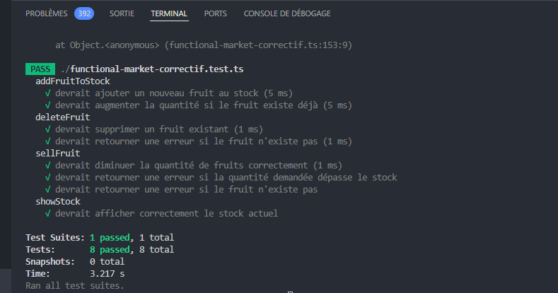
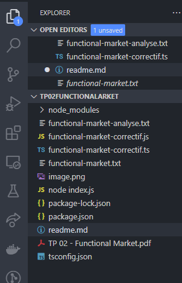

# TP02-TP03-FunctionalMarket

**Functional Market Project**

**Description**
> Ce projet est un petit programme de gestion de stock de fruits, écrit en TypeScript avec une approche fonctionnelle. Il utilise des structures immuables, une gestion explicite des erreurs via le type Either, et minimise les effets secondaires. Le programme permet d'ajouter des fruits au stock, de vendre des fruits, de supprimer des fruits et de visualiser l'état du stock.

> L'analyse du fichier original function-market.txt a révélé plusieurs problèmes liés à la mutabilité des données, aux effets secondaires et à l'absence de gestion explicite des erreurs. Ces observations sont détaillées dans le fichier function-market-analyse.txt. Le fichier function-market-correctif.ts contient la version corrigée du programme en respectant les principes de programmation fonctionnelle.

**Contenu du projet**
functional-market.txt : Le fichier source original du programme à analyser.
functional-market-analyse.txt : Analyse détaillée du programme original, contenant les observations et suggestions d'amélioration.bloc

functional-market-correctif.ts : Code corrigé, appliquant les suggestions issues de l'analyse, avec des améliorations telles que l'immuabilité et la gestion des erreurs.

functional-market-correctif.test.ts: Contient les tests unitaires.

**Fonctionnalités principales**
Ajouter des fruits au stock : Si le fruit existe déjà, sa quantité est mise à jour ; sinon, un nouveau fruit est ajouté.
Vendre des fruits : Réduit la quantité d'un fruit dans le stock, si suffisant.
Supprimer des fruits du stock : Supprime un fruit par son nom.
Afficher le stock : Affiche la liste actuelle des fruits et leur quantité.

**Prérequis**
Node.js : Version 18 ou supérieure
npm : Installé avec Node.js
TypeScript : Inclus dans le projet via ts-node
Installation
Clone le dépôt sur ta machine locale :

git clone <https://github.com/DH-HUB/TP02-TP03-FunctionalMarket>
**Accède au dossier du projet :**

'cd functional-market'
Installe les dépendances nécessaires :

'npm install'
Cela installera TypeScript et ts-node pour exécuter le code TypeScript.

'npm install --save-dev jest ts-jest @types/jest'
Cela installera Jest 

'npx jest'
Pour l'execution des tests

**Utilisation**
Pour exécuter le programme, utilisez la commande suivante :

'npx ts-node functional-market-correctif.ts'

Cela va exécuter le fichier principal functional-market-correctif.ts et afficher les résultats des différentes opérations sur le stock.

**Exemple de sortie**

**Exemple de sortie tests**

Structure du projet
Le projet est structuré comme suit :

Explication du code
Gestion des erreurs avec Either :

Les fonctions renvoient soit un succès Right, soit une erreur Left, ce qui permet de gérer les erreurs de manière explicite.
**Immuabilité :**

Chaque modification sur le stock génère un nouveau tableau, sans modifier directement le tableau existant fruitsStock.
**Effets secondaires minimisés :**

Les fonctions principales ne font pas de console.log, elles renvoient simplement des valeurs ou des erreurs, laissant le choix au code appelant de gérer ces résultats.

**Auteur : Hakima Djermouni**

Contributions bienvenues ! Ouvrez une issue ou soumettez une pull request.

Licence
Ce projet est sous licence MIT - voir le fichier LICENSE pour plus de détails.
